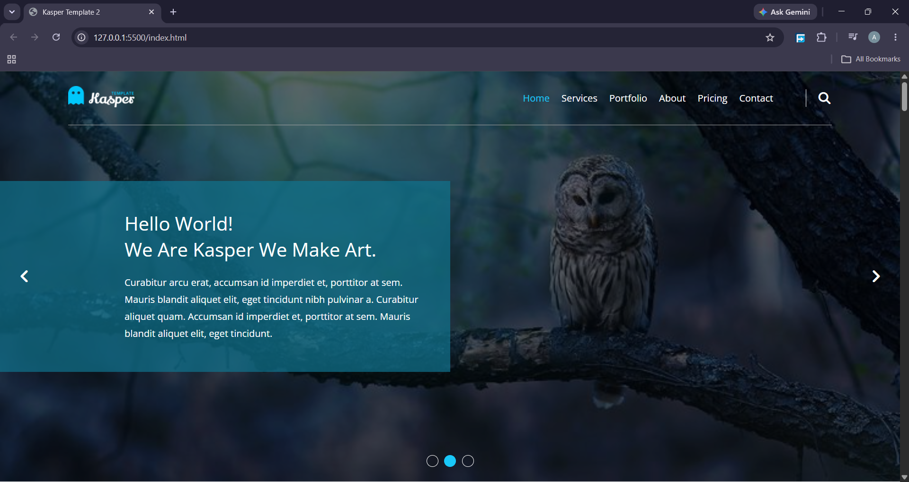

# kasper
A fully response landing page for creative agency, built using a Mobile-First approach with HTML 5, CSS 3, JS

## 📖 About The Project
This is a fully responsive landing page designed for a creative agency. It showcases advanced layout techniques and interactive features built with HTML, CSS, and vanilla JavaScript. The project goes beyond a static template by incorporating dynamic elements like an image slider, portfolio filter, and scroll-triggered animations.

## 🚀 Live Demo
[View the live project here](https://abdullahalbaaj.github.io/Memes-Generator/)

## 🛠️ Built With
- **HTML5** – Semantic markup
- **CSS3** – CSS Variables, Flexbox, CSS Grid, Media Queries
- **JavaScript** – DOM manipulation, Intersection Observer, Form Validation, Dynamic Content
- **Font Awesome** – Icons

## ✨ Key Features
- **Fully Responsive & Mobile-First**: Optimized for all screen sizes.
- **Dynamic Image Slider**: Navigate through landing page backgrounds with arrows or bullets.
- **Portfolio Filter**: Filter projects by category (App, Photo, Web, Print) without reloading the page.
- **Scroll-Triggered Animations**: Skills progress bars and stats counters animate when they come into view.
- **Form Validation**: Prevents submission if required fields are empty or email format is invalid.
- **Interactive Mobile Menu**: Hamburger menu toggles navigation on smaller screens.
- **Auto-Updating Footer**: The current year is dynamically inserted in the copyright notice.

## 📸 Screenshot

## 📂 Project Structure
kasper/
├── css/
│ ├── kasper.css (main styles)
│ ├── normalize.css
│ └── all.min.css (Font Awesome)
├── images/
│ ├── logo.png
│ ├── landing1.png
│ └── ... (all project images)
├── videos/
│ └── awesome-video.mp4
├── logic.js (all JavaScript functionality)
└── index.html
